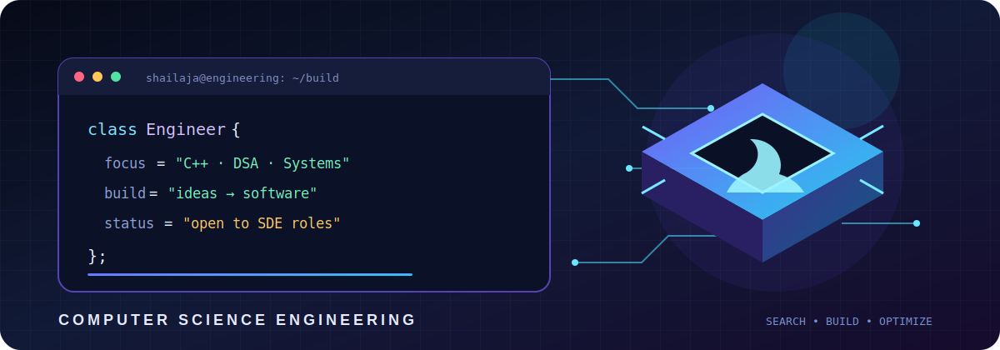
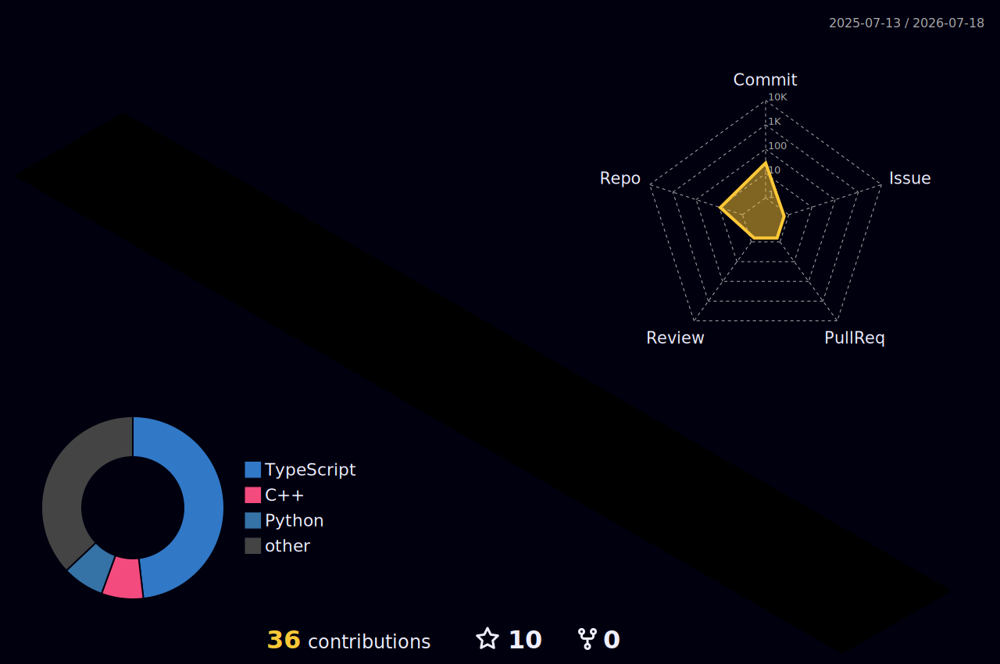

<div align="center">



</div>

<div align="center">

# Hi, I'm Shailaja Singh 👋

### Computer Science Engineering Student · C++ Developer · Software Builder

I build algorithm-driven systems and practical web applications—from a UCI chess engine in C++ to full-stack developer platforms.

[](https://shailaja-singh.vercel.app)
[](https://github.com/sshailaja03?tab=repositories)

</div>

---

## About me

- 🎓 Pursuing B.Tech in Computer Science and Engineering at Lovely Professional University
- ⚙️ Interested in software engineering, algorithms, backend systems, and performance-aware C++
- ♟️ Building **Sofia**, a UCI-compatible chess engine with iterative deepening and alpha-beta search
- 🧠 Practising data structures, algorithms, problem solving, and complexity analysis
- 🐧 Comfortable working with Git, GitHub, Linux, REST APIs, and modern development workflows
- 🎯 Seeking entry-level **Software Development Engineer** opportunities

## Featured engineering work

<table>
<tr>
<td width="50%" valign="top">

### ♟️ [Sofia Chess Engine](https://github.com/sshailaja03/Chess-Engine)

A UCI-compatible chess engine written in C++17.

**Engineering highlights**

- Negamax with alpha-beta pruning
- Iterative deepening
- Quiescence search
- MVV-LVA move ordering
- Principal variation tracking

**Tech:** C++17 · Algorithms · OOP · UCI

</td>
<td width="50%" valign="top">

### 🚀 [DevLink](https://github.com/sshailaja03/project-showcase)

A full-stack platform where developers can manage and present their projects through public profiles.

**Engineering highlights**

- JWT-based authentication
- Project management dashboard
- Public developer profiles
- Responsive interactive interface

**Tech:** React · Node.js · Express · MongoDB

</td>
</tr>
<tr>
<td width="50%" valign="top">

### 🛍️ [Aura Shop](https://github.com/sshailaja03/aura-shop)

A responsive e-commerce experience with product discovery and complete shopping flows.

**Engineering highlights**

- Search, filtering, cart, and wishlist
- Reusable UI components
- Centralised application state
- Responsive light and dark themes

**Tech:** React · TypeScript · Zustand · Tailwind CSS

</td>
<td width="50%" valign="top">

### 🌐 [Developer Portfolio](https://github.com/sshailaja03/portfolio)

My personal portfolio for presenting projects, skills, and software-development experience.

**Engineering highlights**

- Responsive project presentation
- Reusable typed components
- Production deployment
- Mobile-friendly interface

**Tech:** Next.js · React · TypeScript · Vercel

</td>
</tr>
</table>

## Technical toolkit

**Core programming**


**Web development**


**Systems and tools**


## What I bring to a team

```text
Strong fundamentals  +  Curiosity  +  Consistent execution
        DSA           +    C++     +   Product thinking
```

I enjoy breaking difficult problems into smaller parts, understanding the trade-offs behind a solution, and turning ideas into software that can be demonstrated and explained.

## Engineering activity in 3D

<div align="center">



<sub>Generated automatically from my GitHub contribution history.</sub>

</div>

## Currently improving

- Advanced C++ and performance-aware programming
- Trees, graphs, dynamic programming, and system-design fundamentals
- Testing, documentation, and production-quality project structure
- Linux, SQL, and backend troubleshooting

---

<div align="center">

### Let's build something useful.

Explore my [repositories](https://github.com/sshailaja03?tab=repositories) or visit my [portfolio](https://shailaja-singh.vercel.app).

<sub>Open to software engineering opportunities and collaborative projects.</sub>

</div>
